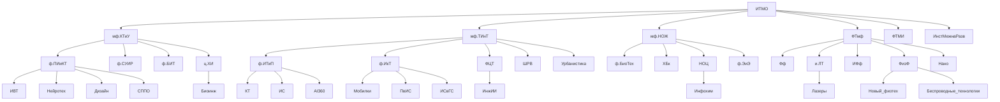

# Гайд первокурсниква ИнжИИ
## Описание
Привет первокурсник! Ты поступил в ИТМО, поздравляю! Пора узнать о том, как тут всё работает!  
Много информации взято из [Гайд по I курсу 🐣 (ВТ ИТМО)](https://github.com/Imtjl/1st-year-guide/tree/main)

# Оглавление
 - [Описание](#описание)
 - [Структура направлений бакалавриата](#структура)
 - [Сленг](#сленг)
 - [Ссылки](#ссылки)
 - [БаРС](#барс)
 - [Гайд как получить БСК для метро](#бск)

# Структура
Структура направлений бакалавриата (p.s. в схеме вероятно есть ошибки, в процессе доработки)

# Сленг 
## Корпуса 
- `Кронва` - главный корпус университета на Кронверском 49
- `Ломо` - корпус университета на Ломоносова 9
- `Биржа` - корпус университета на Биржевой линии 14-16 (основной для ИнжИИ)
- `Гривцова` - корпус университета на Гривцовом переулке 14-16 лит.А
- `Чайка` - корпус университета на Чайковской улице 11.2 лит.А
- `Гастелло` - корпус университета на улице Гастелло 12

## Общежития
> Подробно и наглядно можно посмотреть [тут](https://student.itmo.ru/ru/dormitory/)

- `Вязьма` - общежитие на Вяземском переулке 5-7 лит.А
- `Белорусская / б6 / белка` - общежитие на Белорусской улице д.6 лит.А
- `Альпийка` - общежитие на Альписском переулке 15 к.2 лит.А
- `Ленсовета` - Общежитие на улице Ленсовета д.23 лит.А
- `МСГ` -  Новоизмайловский пр., 16
- `Доходный дом`(а.к.а `Карповка`) - наб. р. Карповки, д. 22, корп. 2, лит. Б
- `ЛТУ` - ул. Вавиловых, д. 12
- `Апарты` - аппартаменты [ITMO.Aparts](https://aparts.itmo.ru)

## Предметы
- `линал` - линейная алгебра
- `дискра` - дискретная информация
- `дм` - дискретная математика
- `матан` - математический анализ
- `прога` - программирование
- `алгосы` - Алгоритмы и структуры данных
- `теорвер` - Теория вероятностей
- `архэвм` - Архитектура вычислительных систем
- `БД` - Базы данных
- `БЖД` - Культура Безопасности Жизнедеятельности
- `функан` - Функциональный анализ

## Промежуточный контроль
- `лаба` - лабораторная работа
- `допы` - дополнительные задания для лаб по усмотрению преподователя
- `рубежка` - рубежный контроль
- `ключевая точка` - обязательная работа, без которой вам не выставят оценку
- `прокторинг` - система прокторинга для дистанционных работ
- `колок` - коллоквиум

## Сокращения
- `гит` - гитхаб (тем не менее git ≠ github) 
- `ноутбук`/`блокнот` - файл для Jupyter lab/notebook
- `кегля`/`кагл` - kaggle.com
- `hf` - huggingface.co
- `моделька` - модель машинного обучения

## Сайты/приложения
- `ИСУ` - isu.itmo.ru - Главная информационная система универа
- `my.itmo` - my.itmo.ru - Самый часто используемый сайт (и приложение) в рамках обучения
- `БаРС` - bars.itmo.ru - Бально-рейтинговая система, то есть ваши оценки. Говорят, инфа тут появляется раньше чем на my.itmo
- `itmo.map` - карта корпусов (мобильное приложение и раздел в my.itmo сервис под названием 'навигатор'). Доступна Кронва, Ломо и Гривцова, а на сайте также есть Биржа. Также карты есть в формате PDF в ИСУ > Полезные ссылки > Навигация (там есть Чайка).

# БаРС
Система, по которой баллы переводятся в оценку. Если дисциплина зачётная - по ней оценки нет, есть только зачет (да/нет) и количество баллов за него ни на что не влияет. Шкала:

| Диапазон баллов | Оценка | Грейд | Описание |
|----------------|--------|------|---------|
| (90; 103]      | A      | 5    | отлично  |
| (83; 90]       | B      | 4    | хорошо   |
| (74; 83]       | C      | 4    | хорошо   |
| (67; 74]       | D      | 3    | удовлетворительно   |
| [60; 67]       | E      | 3    | удовлетворительно   |
| [0; 60)        | FX     | 2    | неудовлетворительно |

## Почему 103, а не 100?
3 балла это что то типа "баллов индивидуальных достижений" - балл, который вам может доставить преподаватель, за то что вы ему нравитесь как студент, или, например, когда вам до 5A не хватает всего 0.1 балла. 

## А что такое зачёт и экзамен?
Дисциплина с экзаменом — это оценка, зачёт — либо есть, либо нет (оценки при этом НЕТ, количество баллов ни на что не влияет). По сути оценку/зачет вы получаете за набранные в семестре баллы. У каждого курса тут своя система. У кого то можно получить 100 баллов вовремя сдав все лабы, иначе — экзамен, у кого то — только экзамен, а у кого то — только через работы. Опять же, всё зависит от преподавателя и по факту надо смотреть именно на это, ИСУ и my.itmo тут вам, увы, не помогут. 

## Что будет, если не сдать?
Вы попадёте на ППА1 и по сути получите доп. период для сдачи работ. В случае, если вы не сдадите ППА1 - вы попадаете на ППА2, где вы перед комиссией должны показать что освоили дисциплину. Если вы не сдали ППА2 - у вас есть шанс на реабелиатцию во время комиссии факультета. Если вы не сдали ППА2, но на момент ППА1 у вас было не сдано только 2 предмета - вы можете повторно изучить их через семестр. [Подробнее](https://student.itmo.ru/ru/relearning/)

# БСК
> Тут гайд как получить БСК для метро и общественного транспорта в целом

## Если вы льготная категория
Для детей из многодетных семей (до 18), детей инвадидов (до 18), детей-сирот и лиц из числа детей сирот (смотрите условия на сайте, можно получить и после 18) и детей получающих пенсию по потери кормильца (смотрите условия на сайте, можно получить и после 18) существует возможность получить бесплатный проездной через органиатор перевозок по адресу Рубинштейна 32 лит А. Перед обращением **обязательно ознакомьтесь со списком требуемых документов на сайте и уточните информацию по телефону**.

Телефон справочной службы: 8(812)576-55-55. 

[Сайт организатора перевозок (cписок документов для оформления)](https://orgp.spb.ru/%D0%BF%D0%B5%D1%80%D0%B2%D0%B8%D1%87%D0%BD%D0%B0%D1%8F-%D0%B2%D1%8B%D0%B4%D0%B0%D1%87%D0%B0/?ysclid=lzujknm6cc911955128)

## Пока не оформлен БСК
С 1 сентября по 1 октября первокурсники получают временный БСК в любой кассе метро при предъявлении паспорта и студенческого. Действует до получения БСК с фотографией

## Вариант 1 (долгий)
Идете на ближайшую станцию метро и просите оформить БСК. С собой - паспорт, студенческий, 4 распечатанные фотографии 3x4 и пошлина 250р. Сроки изготовления - 10 дней

## Вариант 2 (еще дольше)
Посетите [сайт](https://zakaz.ltkarta.ru/) и закажите карту с доставкой в любую удобную станцию. Сроки изготовления - 20 дней

## Вариант 3 (очень быстрый)
>Данный метод в преспективе является наиболее финансово выгодным

Едете на станцию Площать Александра Невского - 2 и идете в Центр изготовления льготных БСК. (https://yandex.ru/maps/-/CDcDJDpz). Стоите очередь, после чего вам на месте сделают и выдадут на руки БСК. С собой - паспорт, студенческий и пошлина 250р. Центр работает с 9:30 до 19:30 без выходных (но в сентябре там огромные очереди на 2+ часа)

## Как связать Единую карту петербуржца и БСК
Все же советую оформить БСК с фото, дополнительная карта вам пригодится.
В кассе метро показываете ЕКП, паспорт и студенческий. Дальнейшие инструкции уточните у кассира.

# Todo
Ого, ты долестал до конца! Поздравляю! За это ты получишь возможность узнать план развития гайда!
- [ ] Добавить коворкинги и не только
- [ ] Рассказать про спорт в ИТМО
- [ ] Добавить информацию по предметам
- [ ] Гайд по Linux, git, LaTeX
- [ ] Дополнить ссылки
- [ ] Добавить полезную литературу по специальности 
