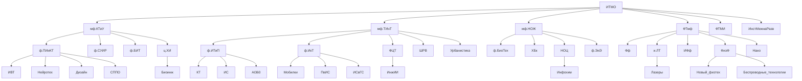

# Гайд первокурсниква ИнжИИ
## Описание
Привет первокурсник! Ты поступил в ИТМО, поздравляю! Пора узнать о том, как тут всё работает!  
Много информации взято из [Гайд по I курсу 🐣 (ВТ ИТМО)](https://github.com/Imtjl/1st-year-guide/tree/main)

# Оглавление
 - [Описание](#описание)
 - [Структура направлений бакалавриата](#структура)
 - [Сленг](#сленг)
 - [БаРС](#БаРС)

# Структура
Структура направлений бакалавриата (p.s. в схеме вероятно есть ошибки, в процессе доработки)

# Сленг 
## Корпуса 
- `Кронва` - главный корпус университета на Кронверском 49
- `Ломо` - корпус университета на Ломоносова 9
- `Биржа` - корпус университета на Биржевой линии 14-16 (основной для ИнжИИ)
- `Гривцова` - корпус университета на Гривцовом переулке 14-16 лит.А
- `Чайка` - корпус университета на Чайковской улице 11.2 лит.А
- `Гастелло` - корпус университета на улице Гастелло 12

## Предметы
- `БЖД` - Культура Безопасности Жизнедеятельности

## Общежития
> Подробно и наглядно можно посмотреть [тут](https://student.itmo.ru/ru/dormitory/)

- `Вязьма` - общежитие на Вяземском переулке 5-7 лит.А
- `Белорусская / б6 / белка` - общежитие на Белорусской улице д.6 лит.А
- `Альпийка` - общежитие на Альписском переулке 15 к.2 лит.А
- `Ленсовета` - Общежитие на улице Ленсовета д.23 лит.А
- `МСГ` -  Новоизмайловский пр., 16
- `Доходный дом` - наб. р. Карповки, д. 22, корп. 2, лит. Б
- `ЛТУ` - ул. Вавиловых, д. 12

## Предметы
- `линал` - линейная алгебра
- `дискра` - дискретная информация
- `матан` - математический анализ
- `прога` - программирование
- `алгосы` - Алгоритмы и структуры данных

## Сайты/приложения
- `ИСУ` - isu.itmo.ru - Главная информационная система универа
- `my.itmo` - my.itmo.ru - Самый часто используемый сайт (и приложение) в рамках обучения
- `БаРС` - bars.itmo.ru - Бально-рейтинговая система, то есть ваши оценки. Говорят, инфа тут появляется раньше чем на my.itmo
# БаРС
Система, по которой баллы переводятся в оценку. Шкала:

(90; 103] - A / 5 / отлично

(83; 90] - B / 4 / хорошо

(74; 83] - C / 4 / хорошо

(67; 74] - D / 3 / удовлетворительно

[60; 67] - E / 3 / удовлетворительно

[0; 60) - FX / 2 / неудовлетворительно

## Что будет, если не сдать?
Вы попадёте на ППА1 и по сути получите доп. период для сдачи работ. В случае, если вы не сдадите ППА1 - вы попадаете на ППА2, где вы перед комиссией должны показать что освоили дисциплину. Если вы не сдали ППА2 - у вас есть шанс на реабелиатцию во время комиссии факультета. Если вы не сдали ППА2, но на момент ППА1 у вас было не сдано только 2 предмета - вы можете повторно изучить их через семестр. [Подробнее](https://student.itmo.ru/ru/relearning/)
