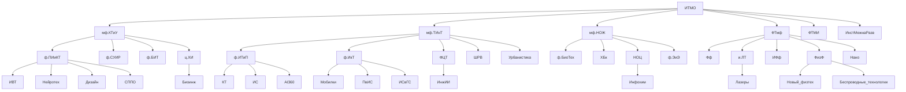

# Гайд первокурсника ИнжИИ
## Описание
Привет первокурсник! Ты поступил в ИТМО, поздравляю! Пора узнать о том, как тут всё работает!  
Часть информации приглянулась из [Гайд по I курсу 🐣 (ВТ ИТМО)](https://github.com/Imtjl/1st-year-guide/tree/main) и с [faq.itmo.is](https://faq.itmo.is)

# Оглавление
 - [Описание](#описание)
 - [Структура направлений бакалавриата](#структура)
 - [Сленг и ссылки](#сленг)
 - [БаРС](#барс)
 - [Стипедии](#стипендии)
 - [Гайд как получить БСК для метро](#бск)
 - [Спорт и физра](#физра)
 - [Пропуск](#пропуск)
 - [Возможности](#возможности)
 - [Коворкинги](#коворкинги)
 - [Лайфхаки и в целом важные вещи](#лайфхаки)

# Структура
Структура направлений бакалавриата (p.s. в схеме вероятно есть ошибки, в процессе доработки)

# Сленг 
## Корпуса 
- `Кронва` - главный корпус университета на Кронверском 49
- `Ломо` - корпус университета на Ломоносова 9
- `Биржа` - корпус университета на Биржевой линии 14-16 (основной для ИнжИИ)
- `Гривцова` - корпус университета на Гривцовом переулке 14-16 лит.А
- `Чайка` - корпус университета на Чайковской улице 11.2 лит.А
- `Гастелло` - корпус университета на улице Гастелло 12

## Общежития
> Подробно и наглядно можно посмотреть [тут](https://student.itmo.ru/ru/dormitory/)

- `Вязьма` - общежитие на Вяземском переулке 5-7 лит.А
- `Белорусская / б6 / белка` - общежитие на Белорусской улице д.6 лит.А
- `Альпийка` - общежитие на Альписском переулке 15 к.2 лит.А
- `Ленсовета` - Общежитие на улице Ленсовета д.23 лит.А
- `МСГ` -  Новоизмайловский пр., 16
- `Доходный дом`(а.к.а `Карповка`) - наб. р. Карповки, д. 22, корп. 2, лит. Б
- `ЛТУ` - ул. Вавиловых, д. 12
- `Апарты` - аппартаменты [ITMO.Aparts](https://aparts.itmo.ru)

## Предметы
- `линал` - линейная алгебра
- `дм/дискра` - дискретная математика
- `матан` - математический анализ
- `прога` - программирование
- `алгосы` - Алгоритмы и структуры данных
- `теорвер` - Теория вероятностей
- `архэвм` - Архитектура вычислительных систем
- `БД` - Базы данных
- `БЖД` - Культура Безопасности Жизнедеятельности
- `функан` - Функциональный анализ

## Промежуточный контроль
- `лаба` - лабораторная работа
- `допы` - дополнительные задания для лаб по усмотрению преподователя
- `рубежка` - рубежный контроль
- `ключевая точка` - обязательная работа, без которой вам не выставят оценку
- `прокторинг` - система прокторинга для дистанционных работ
- `колок` - коллоквиум

## Сокращения
- `гит` - гитхаб (тем не менее git ≠ github) 
- `ноутбук`/`блокнот` - файл для Jupyter lab/notebook
- `кегля`/`кагл` - kaggle.com
- `hf` - huggingface.co
- `моделька` - модель машинного обучения

## Сайты, приложения, группы, чаты и тп
- `ИСУ` - [isu.itmo.ru](isu.itmo.ru) - Главная информационная система универа
- `my.itmo` - [my.itmo.ru](my.itmo.ru) - Самый часто используемый сайт (и приложение) в рамках обучения
- `БаРС` - [bars.itmo.ru](bars.itmo.ru) - Бально-рейтинговая система, то есть ваши оценки. Говорят, инфа тут появляется раньше чем на my.itmo
- `itmo.map` - карта корпусов (мобильное приложение и раздел в my.itmo.ru сервис под названием 'навигатор'). Доступна Кронва, Ломо и Гривцова, а на сайте также есть Биржа. Также карты есть в формате PDF в ИСУ > Полезные ссылки > Навигация (там есть Чайка).
- `Хелпдэск` - [helpdesk.itmo.ru](helpdesk.itmo.ru) - сюда стоит писать когда что то ломается
- `Студенческий офис` - [student.itmo.ru](student.itmo.ru),  [https://t.me/itmolnia](канал), [http://t.me/itmolnia_bot](бот), [https://vk.com/itmostudents](группа ВК)
- `Кронверские барсы (споривный клуб)` - [kronbars.itmo.ru](https://kronbars.itmo.ru/), [ВК](https://vk.com/kronbars) (можно писать в лс)
- `ФЦТ (Факультет цифровых трансформаций)` - вы учитесь здесь. [ВК](https://vk.com/dx.itmo), [tg](https://t.me/dx_itmo), [чат абитуры](https://t.me/ai_itmo)
- `Библиотека` - [сайт](https://lib.itmo.ru), [канал](https://t.me/ITMO_Library)
- `Сообщество выпускников` - много интересных проектов, которые помогают студентам - экскурсии, стипендии и т.д. [Сайт](https://alumni.itmo.ru/), [ВК](https://t.me/itmoalumni), [канал](https://vk.com/alumni.itmo)

# БаРС
Система, по которой баллы переводятся в оценку. Если дисциплина зачётная - по ней оценки нет, есть только зачет (да/нет) и количество баллов за него ни на что не влияет. Шкала:

Для предметов с оценкой:
| Диапазон баллов | Оценка | Грейд | Описание |
|----------------|--------|------|---------|
| (90; 103]      | A      | 5    | отлично  |
| (83; 90]       | B      | 4    | хорошо   |
| (74; 83]       | C      | 4    | хорошо   |
| (67; 74]       | D      | 3    | удовлетворительно   |
| [60; 67]       | E      | 3    | удовлетворительно   |
| [0; 60)        | FX     | 2    | неудовлетворительно |

Для зачётных предметов (кроме физкультуры, там своя система):

| Диапазон баллов | Оценка |
|----------------|--------|
| [60; 103]       |зачёт     | 
| [0; 60)        |незачёт     | 2 

## Почему 103, а не 100?
3 балла это что-то типа "баллов индивидуальных достижений" - балл, который вам может доставить преподаватель на некоторых предметах, за то что вы ему нравитесь как студент, или, например, когда вам до 5A не хватает всего 0.1 балл. Есть преподаватели, которые их просто так не ставят, а ставят за дополнительное задание. А по некоторым предметам их вообще нет.

## А что такое зачёт и экзамен?
Дисциплина с экзаменом — это оценка, зачёт — либо есть, либо нет (оценки при этом НЕТ, количество баллов ни на что не влияет). По сути оценку/зачет вы получаете за набранные в семестре баллы. У каждого курса тут своя система. У кого то можно получить 100 баллов вовремя сдав все лабы, иначе — экзамен, у кого то — только экзамен, а у кого то — только через работы. Опять же, всё зависит от преподавателя и по факту надо смотреть именно на это, ИСУ и my.itmo тут вам, увы, не помогут. 

## Контрольные точки

Однако, не всё так просто. По большинству предметов существуют так называемые ключевые контрольные точки (их обычно в обиходе называют просто "контрольными точками", хотя официально просто "контрольная точка" - любое задание, за которое выставляются баллы в БАРС). Это задания, обязательные к выполнению для получения положительной оценки. Если их не сдать, то поставят "неуд"/"незачёт", сколько бы баллов не было. В БАРСе они выделены красным, в my.itmo - красным (если задание не сдано) или зелёным (если сдано и за него есть необходимый балл).

## Что будет, если не сдать?
Вы попадёте на ППА1 и по сути получите доп. период для сдачи работ. В случае, если вы не сдадите ППА1 - вы попадаете на ППА2, где вы перед комиссией должны показать что освоили дисциплину. Если вы не сдали ППА2 - у вас есть шанс на реабелиатцию во время комиссии факультета. Если вы не сдали ППА2, но на момент ППА1 у вас было не сдано только 2 предмета - вы можете повторно изучить их через семестр. [Подробнее](https://student.itmo.ru/ru/relearning/)

## Преподаватель перегибает палку. Что делать?
Преподаватель хамит, предлагает нездоровую сложность задач, регулярно опаздывает или просто плохо себя ведёт? Можно сделать следующие вещи:
1. Оставить отзыв в приложение `раздел актуальное > пары на сегодня > Смахнуть в право > оценить`)
2. Обратиться в подзразделение реализатор - деканат, FLTC (английский) и тп
> Иногда это делать КАТЕГОРИЧЕСКИ не стоит!
3. Обратиться в **Центр качества организации учебного процесса** - +7 (812) 480-07-02, edu.quality@itmo.ru или аудитория 1421 в корпусе на Ломоносова

# Стипендии

О стипендиях есть статья на сайте ITMO Students: [https://student.itmo.ru/ru/scholarship/](https://student.itmo.ru/ru/scholarship/). Так же много стипендий есть на сайте [стипендиатроссии.рф](https://стипендиатроссии.рф).

Здесь будут описаны только некоторые стипендии, доступные студентам ИТМО.

## ГАС

[ГАС](https://student.itmo.ru/ru/scholarship_basic/) — государственная академическая стипендия. Размер — 2000 рублей в месяц. Выплачивается бюджетникам на 1 семестре и далее при закрытии предыдущего семестра без троек и допсы. Также ее на протяжении всего обучения получают иностранные студенты, обучающиеся по квоте правительства РФ. 

Есть повышенная академическая стипендия, ее выплачивают за отличные оценки или при наличии красного диплома за предыдущий уровень образования (последнее не актуально для бакалавриата).

## ГСС

[ГСС](https://student.itmo.ru/ru/scholarship_social/) — государственная социальная стипендия, выплачивается студентам, относящимся к социально незащищенным категориям граждан (полный список оснований для ГСС смотри [на сайте](https://student.itmo.ru/ru/scholarship_social/)). Размер обычной ГСС — 3000 рублей в месяц. 

Можно также получить ГСС в повышенном размере — 13919 рублей в месяц с учетом ГАС и ГСС. Ее дают за учебу на хорошо и отлично студентам 1 и 2 курса, имеющим право на обычную ГСС.

## ПГАС

[ПГАС](https://student.itmo.ru/ru/scholarship_up/) — повышенная государственная академическая стипендия. Ее можно получить за следующие достижения (более подробные критерии — по ссылкам): 

- [учебные](https://student.itmo.ru/admin/uploads/file/5d77e2cfde921263312509.pdf): отличные оценки, олимпиады/конкурсы по учебным достижениям, награды за проекты или конструкторские работы
- [научно-исследовательские](https://student.itmo.ru/files/836) (нужно подаваться с научным руководителем): статьи в международных журналах, РИД, победы в конкурсах грантов, выступления на конференциях, прочие премии, стипендии и дипломы
- [общественные](https://student.itmo.ru/files/837): волонтерство и организация мероприятий, аффилированных с ИТМО
- [культурно-творческие](https://student.itmo.ru/admin/uploads/ckeditor/%D0%92%D0%BE%D0%B7%D0%BC%D0%BE%D0%B6%D0%BD%D0%BE%D1%81%D1%82%D0%B8/%D0%9F%D0%93%D0%90%D0%A1/pgas_kt_.pdf): материалы для медиа, видеоролики, сценические выступления и прочий креатив
- [спортивные](https://vk.com/@kronbars-pgas): разряды и звания, состязания, тренерская деятельность, ГТО

ПГАС присуждается по итогам конкурса, который проводится каждый семестр (даты меняются каждый год, актуальные уточняйте [на сайте](https://student.itmo.ru/ru/scholarship_up/)).

Размер ПГАС — от 2000 до 27000 рублей в месяц, зависит от количества баллов и места в конкурсе.

Заявка подается через ИСУ. Порядок формирования рейтинга конкурса на ПГАС и инструкции тоже доступны [на сайте](https://student.itmo.ru/ru/scholarship_up/).

## ITMO Family

На 1 и 2 семестре студентам, поступившим по престижным олимпиадам или с высокими баллами ЕГЭ, платится повышенная стипендия от ИТМО (надбавка к ГАС). Есть разные виды надбавок:

- бронзовый — 5000 руб/мес, за 270+ баллов ЕГЭ (без учета ИД)
- серебряный — 8000 руб/мес, за олимпиаду РСОШ 2 уровня или 280+ баллов ЕГЭ (без учета ИД)
- спортивный — 8000 руб/мес, для победителей конкурса “Портфолио спортсмена”, но при условии 260+ баллов ЕГЭ (без учета ИД)
- золотой — 13000 руб/мес, за олимпиаду РСОШ 1 уровня или 290+ баллов ЕГЭ (без учета ИД)
- платиновый — 23000 руб/мес, за призерство или победу во ВсОШ или международной олимпиаде

Стипендия продлевается на 2 семестр при закрытии сессии без троек и допсы. 

## “Добрая стипендия”

“[Добрая стипендия](https://dobro.itmo.ru/)” — платформа, где выпускники ИТМО учреждают для студентов свои собственные стипендии (в течение учебного года могут открыться новые). Для каждой стипендии есть свои критерии отбора. Обычно получателей каждой стипендии немного, 1-3 человека.

## Стипендии от компаний

Стипендия Тинькофф — https://education.tbank.ru/scholarship/

Selectel Career Wave — https://careers.selectel.ru/careerwave_scholarship

Альфа-Шанс — https://alfabank.ru/about/society/alfa-chance/

“Подписка” VK Education — https://education.vk.company/program/239

## Именные стипендии

Стипендия Потанина — https://fondpotanin.ru/activity/stipendialnaya-programma-vladimira-potanina/

Yandex ML Prize / премия Сегаловича — https://yandex.ru/scholarships/

## Государственные стипендии

Стипендии правительства СПБ и Комитета по науке и высшей школе — http://knvsh.gov.spb.ru/contests/

Еще можно получить стипендию президента РФ и правительства РФ.

# БСК
> Тут гайд как получить БСК для метро и общественного транспорта в целом

## Если вы льготная категория
Для детей из многодетных семей (до 18), детей инвадидов (до 18), детей-сирот и лиц из числа детей сирот (смотрите условия на сайте, можно получить и после 18) и детей получающих пенсию по потери кормильца (смотрите условия на сайте, можно получить и после 18) существует возможность получить бесплатный проездной через органиатор перевозок по адресу Рубинштейна 32 лит А. Перед обращением **обязательно ознакомьтесь со списком требуемых документов на сайте и уточните информацию по телефону**.

Телефон справочной службы: 8(812)576-55-55. 

[Сайт организатора перевозок (cписок документов для оформления)](https://orgp.spb.ru/%D0%BF%D0%B5%D1%80%D0%B2%D0%B8%D1%87%D0%BD%D0%B0%D1%8F-%D0%B2%D1%8B%D0%B4%D0%B0%D1%87%D0%B0/?ysclid=lzujknm6cc911955128)

## Пока не оформлен БСК
С 1 сентября по 1 октября первокурсники получают временный БСК в любой кассе метро при предъявлении паспорта и студенческого. Действует до получения БСК с фотографией

## Вариант 1 (долгий)
Идете на ближайшую станцию метро и просите оформить БСК. С собой - паспорт, студенческий, 4 распечатанные фотографии 3x4 и пошлина 250р. Сроки изготовления - несколько дней

## Вариант 2 (еще дольше)
Посетите [сайт](https://zakaz.ltkarta.ru/) и закажите карту с доставкой в любую удобную станцию. Сроки изготовления - несколько дней

## Вариант 3 (очень быстрый)
>Данный метод в перспективе является наиболее финансово выгодным

Едете на станцию Площать Александра Невского - 2 и идете в Центр изготовления льготных БСК. (https://yandex.ru/maps/-/CDcDJDpz). Стоите очередь, после чего вам на месте сделают и выдадут на руки БСК. С собой - паспорт, студенческий и пошлина 250р. Центр работает с 9:30 до 19:30 без выходных (но в сентябре там огромные очереди на 2+ часа)

## Как связать Единую карту петербуржца и БСК
Все же советую оформить БСК с фото, дополнительная карта вам пригодится.
В кассе метро показываете ЕКП, паспорт и студенческий. Дальнейшие инструкции уточните у кассира.

# Физра
## Как закрыть?
Ваша задача по физкультуре: набрать 100 баллов (ИМЕННО 100, НИ МЕНЬШЕ) за семестр. Как вы можете это сделать,
### Вариант А: вы не в экстернате, секции, сборной, спецпроекте и не освобождены от физры
Как набрать баллы?
 1. Ходить на секции (5 баллов за посещение, максимум 2 в неделю и 25 в семестр, если не потменить и не прийти - 0 баллов, на сессии словия другие). Надо набрать как минимум 60 баллов для зачёта
 2. Нормативы ([ссылка на них](https://docs.google.com/document/d/1NW9iZ_DtXKiXvtBKAxHkMi_e9t5JbUrLpdbXp1yiOk4/edit))
 3. Доп. активности ([ссылка на них](https://docs.google.com/document/d/1CYvHsqruXNTmNkT-h_bCiiQBOjth5PWry5Xx6MjbbCs/edit))
#### Что будет, если не успею закрыться?
Будете ходить на секции для должников в спец. период. для должников. Но теперь без стипы по идее, тут не уверен. 
### Вариант Б: освобождение
Тут вы делаете проект и сдаёте его 
#### Что будет, если не успею закрыться?
Сдаете тесты на платформе ИТМО, ВАЖНО: 1 попытка на тест (!!!), надо набрать 100 баллов (по карйней мере было так).
#### Временное освобождение
Сдаёте тесты на Moodle.
### Вариант В: всё остальное
Тут зависит от проекта, у всех разные условия.

## Медкомиссия 
1. Получите 086-у
2. Сдайте флюрографию
3. Придите в спорт комплекс на Вязьме и сдайте справки, пройдите мед комиссию

# Пропуск
В ИТМО можно зайти двумя основными методами:
1. Пропуск в приложение и ИСУ в виде QR-кода
2. Кампусная карта или пропуск записаный на любую другую карту
Подробнее про пункт 2: как только вы получите ИСУ вы сможете сделать себе физический пропуск в виде карты. Для этого вам необходимо прийти в УФБ (управление физической безопасности) в корпусе на Кронверской с любой картой, например проездной или банковской. Специалисты управления помогут сделать вам пропуск, который будет работать по этой карте. Предыдущий функционал карты вы не потеряете. С собой нужен паспорт или студенческий билет для верификации вашей личности.

# Возможности
Ты поступил в ИТМО, по этому у тебя их масса! Перечислю часть (без ссылок, но легко гуглиться и ищется, поэтому в угоду количества и скорости пишу без них, пул реквесты с ссылками одобряются):
 1. Акселератор и возможности для бизнеса
 2. Работа в университете (лаборатори И НЕ ТОЛЬКО)
 3. Мероприятия
 4. Коворкинги и другие простраства
 5. Клубная система
 6. Бонусы как студенту вообще и как студенту в частности ИТМО (бесплатный Яндекс 360 например)
 7. Бесплатная психологическая помощь
 8. Разговорные клубы и другие возможности изучать язык
 9. Дополнительное образование
 10. Выезды в Ягодноное
 11. Международные активности и обмен
 12. Развитие в науке
 13. Фаблаблайнукаеа
 14. Выборность (ЭТО КРУТО, СЕРЬЁЗНО)
 15. Бесплатные переговорки, студии для съёмки (ограничено)
 16. Библиотека и масса её возможностей (кстати, рекомендую сделать читательскиий в обычной библиотеке СПб, лучше в Маяковской - они предлагают много бесплатных онлайн библиотек)
 17. ITMO.Print
 18. Музей оптики
 19. Сообщество выпускников (полезно и студентам, они устраиваютт ментроство например)
...и многое другое 

# Коворкинги 
Отмечу что также через ИСУ вы можете забронировать конкретное помоещения на время для вас. 
## Кронверский
1. Ректорский хол (с 8 до 22 по будням)
2. Коворкинг для студентов: 3 этаж правого крыла (24/7)
3. Тихий коворкинг: в коворкинге для студентов (режим работы уточню потом, наверное)
4. Коворкинг для сотрудников: 4 этаж, правое крыло, только сотрудники (режим работы уточню потом, наверное)
5. Арт коворкинг: 4 этаж, правое крыло (режим работы уточню потом, наверное)
6. Колонный зал: левое крыло 3 этаж, прямо до упора (24/7)
7. Яндекс: дойти до колонного, пойти по большой лестнице вниз, дальше прямо, в те двери которые стоят перед вами (режим работы уточню потом, наверное)
8. "Коворкинг" КТ: дойти до Колонного, свернуть направо, идти до конца и спуститья по большой лестнице - справа по коридору будет мини коворкинг, слева в самом низу тоже, но похуже (24/7 вроде)
9. Столовая (режим работы уточню потом, наверное)
10. Любая аудитория, если она открыта
## Ломо
1. Хол на втором и первом этаже (основная лестница, 24/7)
2. "Ромб" на втором и первом этаже основной лестницы (направо относительно хола)
3. Коворкинг под ФЛТК (центр языков), маршрут и время работы уточняется (центр языков)
4. Коворкинг на третьем этаже (3 этаж, основная лестница, слева, 24/7)
5. Мини-коворкинги (3 и 4 этаж, основная лестница, до упора направо, 24/7)
6. Библиотека (5 этаж, основная лестница, слева, режим работы уточню(наверное))
7. Студ офис (4 этаж, основная лестница, слева, режим работы уточню(наверное))
8. Кронбарс (маршрут уточняется, может быть закрыт (точно не знаю), режим работы уточню(наверное))
9. Аудитория 4314 (маршрут уточняется, может быть закрыт (точно не знаю), режим работы уточню(наверное))
10. Любая аудитория, если она открыта
## Биржа (без маршрутов и графиков работы)
1. Мини коворкинг ИКТ
2. Коворкинг ФТМИ
3. Коворкинг стартап-чердака

# Лайфхаки

## В {SOMEWHERE} сломан(а/о) {SOMETHING}, что делать? 
Найдите специальный QR код (на розовой или белой наклейке) и отсканируйте его. Вас перенаправит в бота где вы сможете создать запрос.

## Что то не работает в ИСУ/сломалось выборность/я не знаю что делать в такой ситуации (и другие студенты не смогли помочь)
Если знаете, кто или какой отдел за это отвечает - пишите им, обычно это работает, а иначе:
1. Пойти в студофис/написать/позвонить
2. Написать на helpdesk

# Благодарности 
Основной автор - Артём Заборщиков, [github](https://github.com/zaborshikov)
Стипендии и исправления орфографии - Данил Федоров [github](https://github.com/down-shift)
Сокращения и БСК - [gothub](https://github.com/noname070)
Орфография и сильное обновление по БаРС - [github](https://github.com/warmike01)
Спорт - некий аноним, имя которого я пока что скрою (не спросил, можно ли и хочет ли человек что бы его упомянули)

# Todo
Ого, ты долестал до конца! Поздравляю! За это ты получишь возможность узнать план развития гайда!
- [x] Добавить коворкинги и не только (осталось дополнить)
- [x] Рассказать про спорт в ИТМО
- [x] Стипендии (требует проверки и обновления информации)
- [x] Пропуск (осталось дополнить)
- [x] Возможности (осталось дополнить)
- [ ] Факультативы 
- [ ] Работа
- [ ] Добавить информацию по предметам
- [ ] Гайд по Linux, git, LaTeX
- [x] Дополнить ссылки (можно дополнить)
- [ ] Добавить полезную литературу по специальности
- [x] Благодарности
