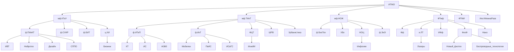

# Гайд первокурсниква ИнжИИ
## Описание
Привет первокурсник! Ты поступил в ИТМО, поздравляю! Пора узнать о том, как тут всё работает! 

# Оглавление
 - [Описание](#описание)
 - [Структура направлений бакалавриата](#структура)
 - [Сленг](#сленг)

# Структура
Структура направлений бакалавриата (p.s. в схеме вероятно есть ошибки, в процессе доработки)

# Сленг 
## Корпуса 
- `Кронва` - главный корпус университета на Кронверском 49
- `Ломо` - корпус университета на Ломоносова 9
- `Биржа` - корпус университета на Биржевой линии 14-16 (основной для ИнжИИ)
- `Гривцова` - корпус университета на Гривцовом переулке 14-16 лит.А
- `Чайка` - корпус университета на Чайковской улице 11.2 лит.А
- `Гастелло` - корпус университета на улице Гастелло 12

## Предметы
- `БЖД` - Культура Безопасности Жизнедеятельности
